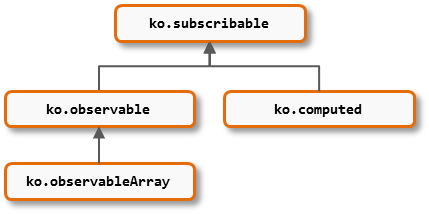

# 使用 `fn` 来添加自定义函数

有时，你可能通过给 Knockout 的核心类型添加新的功能来流水线化你的代码。
你可以在任何以下类型上定义自定义函数：



由于继承性，如果你给 `ko.subscribable` 添加了一个函数，则它在所有其它类型上也可用。
若你个 `ko.observable` 添加了一个函数，则它仅会被 `ko.observableArray` 继承，而在 `ko.computed` 不可用。

要添加一个自定义函数，可以将它添加到以下扩展点：

* ko.subscribable.fn
* ko.observable.fn
* ko.observableArray.fn
* ko.computed.fn

然后你的自定义函数将在所有在该点以后所创建的该类型的所有值上可用。

> 注： 最好仅对确实可用于大量场景的自定义函数使用该扩展点。
> 如果你仅打算用一次的话，你不需要给这些命名空间添加自定义函数。

### 示例： 一个 observable 数组的过滤视图

这里是定义可用于所有随后创建的 `ko.observableArray` 实例的 `filterByProperty` 函数的方式：

```javascript
ko.observableArray.fn.filterByProperty = function(propName, matchValue) {
    return ko.pureComputed(function() {
        var allItems = this(), matchingItems = [];
        for (var i = 0; i < allItems.length; i++) {
            var current = allItems[i];
            if (ko.unwrap(current[propName]) === matchValue)
                matchingItems.push(current);
        }
        return matchingItems;
    }, this);
}
```

它会返回一个新的 computed 值，其中提供了该数组的一个过滤的视图，而原始的数组不会改变。
因为过滤的数组时一个 computed observable，它会在底层数组变更时被重求值。

以下活动示例显示了你可以如何使用它：

源码： 视图

```html
<h3>All tasks (<span data-bind="text: tasks().length"> </span>)</h3>
<ul data-bind="foreach: tasks">
    <li>
        <label>
            <input type="checkbox" data-bind="checked: done" />
            <span data-bind="text: title"> </span>
        </label>
    </li>
</ul>
 
<h3>Done tasks (<span data-bind="text: doneTasks().length"> </span>)</h3>
<ul data-bind="foreach: doneTasks">
    <li data-bind="text: title"></li>
</ul>
```

源码： 视图模型

```javascript
function Task(title, done) {
    this.title = ko.observable(title);
    this.done = ko.observable(done);
}
 
function AppViewModel() {
    this.tasks = ko.observableArray([
        new Task('Find new desktop background', true),
        new Task('Put shiny stickers on laptop', false),
        new Task('Request more reggae music in the office', true)
    ]);
 
    // Here's where we use the custom function
    this.doneTasks = this.tasks.filterByProperty("done", true);
}
 
ko.applyBindings(new AppViewModel());
```

#### 它不是强制的

如果你倾向于大量地过滤 observable 数组，全局性地给所有的 observable 数组添加一个 `filterByProperty`
可让你的代码更简洁。但如果你只是偶尔需要过滤，
你可以不将其添加到 `ko.observableArray.fn`， 而只是如下手动地构造 `doneTasks`：

```javascript
this.doneTasks = ko.pureComputed(function() {
    var all = this.tasks(), done = [];
    for (var i = 0; i < all.length; i++)
        if (all[i].done())
            done.push(all[i]);
    return done;
}, this);
```